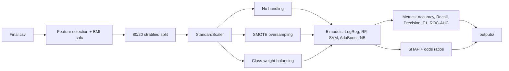
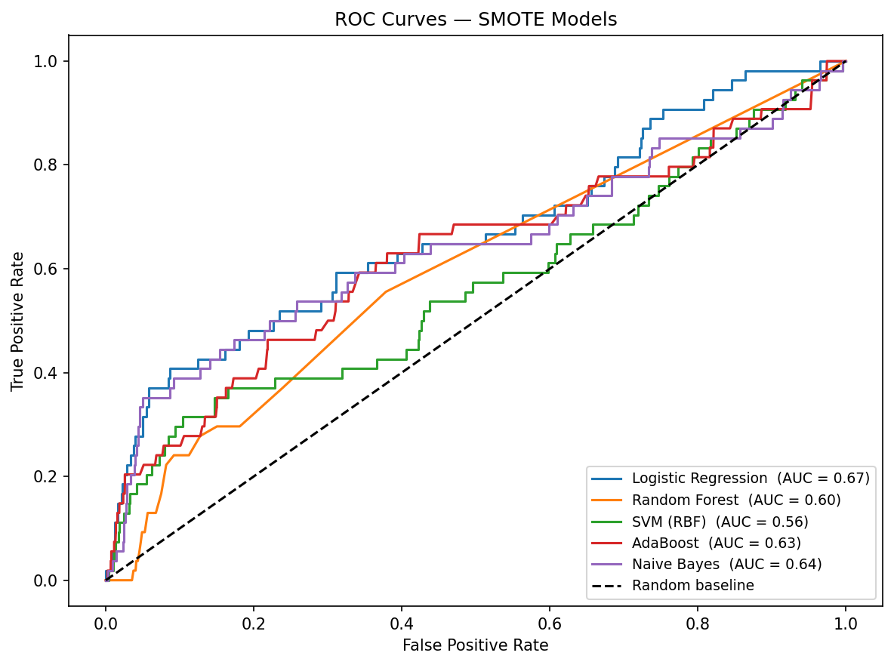
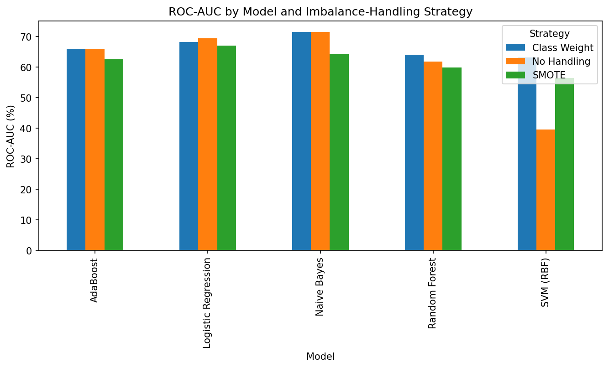
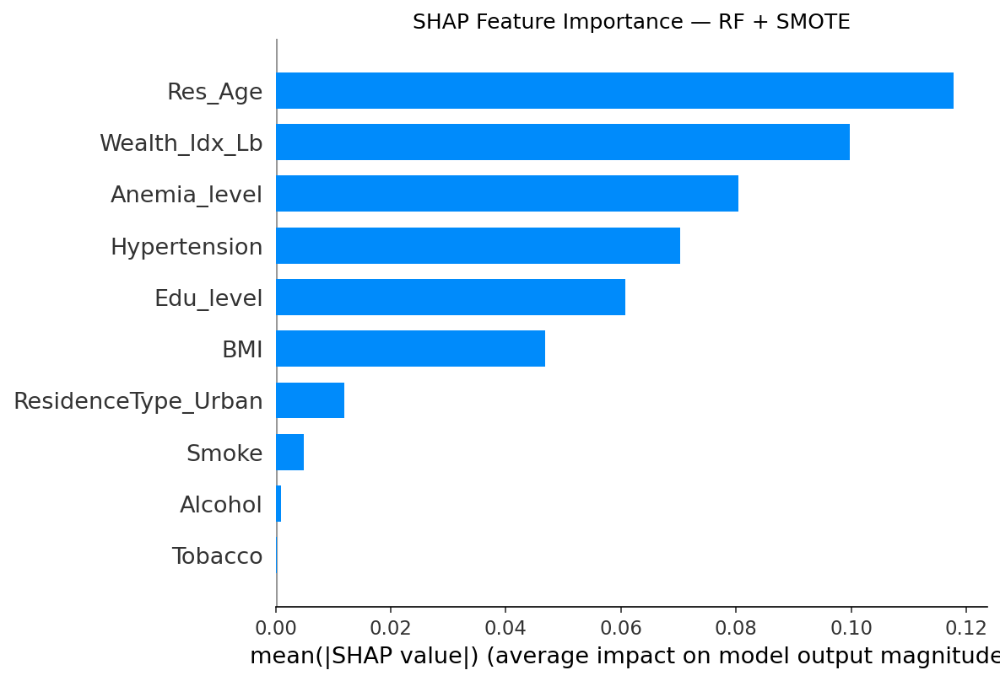

# 🩺 Diabetes Risk Prediction — NFHS-5 Benchmark

Benchmarking five classic ML models to predict Type-II diabetes risk from India's **National Family Health Survey (NFHS-5)** data, with a focus on handling severe class imbalance (~0.9% prevalence) and explaining *why* the models predict what they predict.

## 📊 Dataset

- **Source:** `Final.csv` — 136k+ respondent records, 92 columns (NFHS-5 Individual Recode).
- **Target:** `Diabetes` (0 = No, 1 = Yes)
- **Features used:**

  | Feature | Description |
  |---|---|
  | `Res_Age` | Respondent age |
  | `BMI` | Computed from height & weight |
  | `Edu_level` | Education level |
  | `Wealth_Idx_Lb` | Household wealth index |
  | `Tobacco`, `Smoke` | Tobacco / smoking use |
  | `Alcohol` | Alcohol use |
  | `Hypertension` | Hypertension status |
  | `ResidenceType_Urban` | Urban vs. rural |
  | `Anemia_level` | Anaemia level |

A 30,000-row stratified sample is used (full 136k is unnecessarily slow for SVM with no accuracy gain).

### 🔒 Data Access

`Final.csv` is **not included in this repo**. NFHS-5 is [DHS Program](https://dhsprogram.com/) microdata, and its data-use agreement restricts redistribution of the unit-level file — only the researcher who requested it may hold a copy.

To reproduce end-to-end: request the NFHS-5 India Individual Recode dataset from the DHS Program, build a CSV with the columns listed above (respondent age, BMI inputs, education, wealth index, tobacco/alcohol use, hypertension, residence type, anaemia level, diabetes flag), and drop it in the repo root as `Final.csv`.

You don't need the raw file to see the project's output, though — every chart and result table in [`outputs/`](outputs/) below was already generated from the real dataset and is committed as-is, and the notebook's saved cells show the full executed run.

## 🔁 Pipeline



## 🤖 Models × Imbalance Strategies

| | No Handling | SMOTE | Class Weight |
|---|---|---|---|
| Logistic Regression | ✅ | ✅ | ✅ |
| Random Forest | ✅ | ✅ | ✅ |
| SVM (RBF) | ✅ | ✅ | ✅ |
| AdaBoost | ✅ | ✅ | defaults (no `class_weight` support) |
| Naive Bayes | ✅ | ✅ | defaults (no `class_weight` support) |

## 📈 Results

Full metrics: [`outputs/model_results.csv`](outputs/model_results.csv)

| Method | Model | Accuracy | Recall | ROC-AUC |
|---|---|---|---|---|
| No Handling | Naive Bayes | 94.5% | 25.9% | **71.6%** |
| Class Weight | Naive Bayes | 94.5% | 25.9% | **71.6%** |
| No Handling | Logistic Regression | 99.1% | 0.0% | 69.4% |
| SMOTE | Logistic Regression | 83.5% | **42.6%** | 67.0% |
| Class Weight | SVM (RBF) | 84.5% | **42.6%** | 63.2% |

**Takeaway:** with diabetes prevalence under 1%, accuracy is a misleading metric — several models hit 99% accuracy by never predicting a positive case (0% recall). For a *screening* use case, recall is what matters: SMOTE/class-weighted Logistic Regression and SVM trade some accuracy for meaningfully better recall (~43%), while Naive Bayes gives the best overall ROC-AUC. None of the models are strong enough for clinical deployment as-is — see [Limitations](#-limitations).




### Feature Importance

SHAP confirms `Hypertension`, `Res_Age`, and `BMI` as the top drivers — consistent with established diabetes risk factors, and with the logistic regression odds ratios in [`outputs/odds_ratios.csv`](outputs/odds_ratios.csv).



## ⚠️ Limitations

- Severe class imbalance (0.91% positive) caps recall achievable without more aggressive resampling or a different modeling approach (e.g. anomaly detection framing, ensemble of resampling methods).
- `Diabetes` is a self-reported survey field, not a lab diagnosis — subject to reporting bias.
- Hyperparameters are left at sensible defaults; no tuning was performed.

## 🚀 Getting Started

```bash
pip install -r requirements.txt
# place your own Final.csv in the repo root — see Data Access above
jupyter notebook Diabetes_ML_Benchmark.ipynb
```

Running the notebook end-to-end regenerates everything in `outputs/`.

## 📁 Repo Structure

```
.
├── Diabetes_ML_Benchmark.ipynb   # Full analysis: load → train → evaluate → explain
├── Final.csv                     # NFHS-5 dataset (not committed — see Data Access)
├── outputs/                      # Generated charts & result tables
├── requirements.txt
└── LICENSE
```

## 🛠️ Tech Stack

`pandas` · `numpy` · `scikit-learn` · `imbalanced-learn` (SMOTE) · `shap` · `matplotlib`

## 📄 License

[MIT](LICENSE)
